# Architecture Guide

This guide gives contributors a map of the PDF-Assistant-RAG runtime before
they change an endpoint, storage model, or RAG step. The README keeps the
product overview; this page focuses on how requests move through the system.

---

## Table of Contents

1. [System Overview](#system-overview)
2. [Backend Architecture](#backend-architecture)
   - [Route Structure](#route-structure)
   - [Business Logic Layer](#business-logic-layer)
   - [RAG Pipeline](#rag-pipeline)
   - [Authentication Flow](#authentication-flow)
   - [Data Models & Relationships](#data-models--relationships)
   - [Background Tasks](#background-tasks)
3. [Frontend Architecture](#frontend-architecture)
   - [Pages & Routing (Next.js App Router)](#pages--routing-nextjs-app-router)
   - [State Management (Zustand)](#state-management-zustand)
   - [API Client Layer](#api-client-layer)
   - [Component Tree](#component-tree)
   - [Data Flow: Action → Store → API → Response → UI](#data-flow-action--store--api--response--ui)
4. [Infrastructure](#infrastructure)
   - [Docker Multi-Stage Build](#docker-multi-stage-build)
   - [CI/CD Pipelines](#cicd-pipelines)
   - [Environment Configuration](#environment-configuration)
5. [Data Flow Diagrams](#data-flow-diagrams)
   - [Upload → Process → Query](#upload--process--query)
   - [Login → Token Refresh → OAuth](#login--token-refresh--oauth)
   - [Question → RAG → Streamed Answer](#question--rag--streamed-answer)
6. [Data Ownership & Boundaries](#data-ownership--boundaries)
7. [Swagger & OpenAPI Notes](#swagger--openapi-notes)
8. [Local Contributor Checklist](#local-contributor-checklist)

---

## System Overview

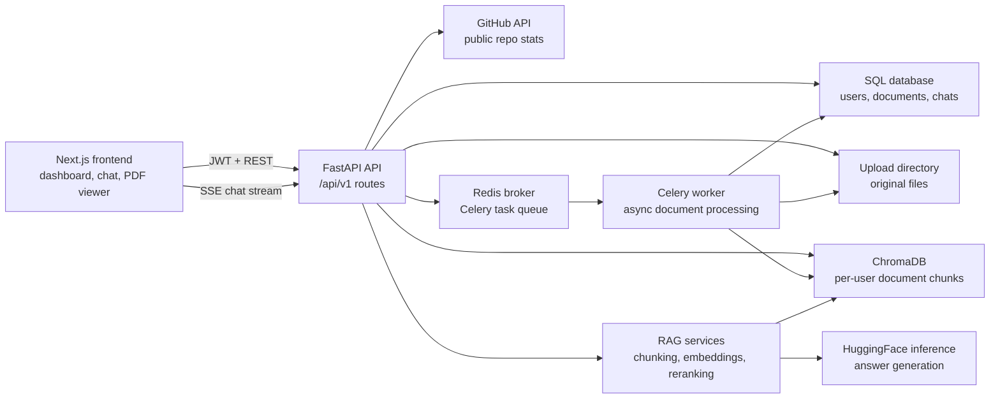

The frontend is a Next.js application that talks to the FastAPI backend. In
development it usually runs on `http://localhost:3000`; the backend runs on
`http://localhost:8000` and exposes Swagger at `http://localhost:8000/docs`.
In production the backend can also serve the exported frontend from
`frontend/out` when that directory exists.

Redis acts as both the Celery broker (task queue) and result backend. The
Celery worker handles expensive document processing (text extraction,
chunking, embedding, graph building) asynchronously so the API stays
responsive.

---

## Backend Architecture

### Route Structure

All API routes are mounted under `/api/v1` in `backend/app/main.py`:

```python
app.include_router(auth_router, prefix="/api/v1")
app.include_router(documents_router, prefix="/api/v1")
app.include_router(chat_router, prefix="/api/v1")
app.include_router(github_router, prefix="/api/v1")
app.include_router(admin_router, prefix="/api/v1")
app.include_router(workspaces_router, prefix="/api/v1")
```

| Route group | Prefix | Main file | Responsibility |
| --- | --- | --- | --- |
| Auth | `/api/v1/auth` | `routes/auth.py` | Registration, login, Google OAuth, JWT refresh/verify, email verification, API key management, profile update, password change |
| Documents | `/api/v1/documents` | `routes/documents.py` | Upload (multipart + URL), list, status polling, serve PDF, rename, update metadata, soft-delete, chunk settings, table extraction |
| Chat | `/api/v1/chat` | `routes/chat.py` | Ask (non-streaming), ask/stream (SSE), session CRUD, history, message feedback, share message |
| GitHub | `/api/v1/github/stats` | `routes/github.py` | Cached public repo stats for landing page |
| Admin | `/api/v1/admin` | `routes/admin.py` | User inventory, operational stats, system metrics |
| Workspaces | `/api/v1/workspaces` | `routes/workspaces.py` | Workspace invitations, collaborative spaces |
| Profile | `/api/v1/profile` | `routes/profile.py` | User profile display name & avatar updates |
| Health | `/health`, `/api/health` | `main.py` | Lightweight health check (API, SQL, Chroma) |

**FastAPI route files follow a consistent pattern:**
1. Route handler receives request + dependencies (DB session, current user)
2. Input validation via Pydantic schemas
3. Business logic inline or delegated to `services/`
4. Response serialization via `response_model`

### Business Logic Layer

The project does **not** have a formal service layer for all operations.
Business logic lives in two places:

1. **Inline in route handlers** — most CRUD operations (auth, chat sessions,
   admin) are handled directly in route files for simplicity.
2. **`app/services/` directory** — complex or shared logic is extracted:
   - `document_ingestion.py` — handles file parsing, table extraction, and
     orchestrates the full ingestion pipeline
   - `layout_parser.py` — advanced PDF layout analysis (headings, tables,
     figures) using a hierarchy of parser classes

```
backend/app/services/
├── __init__.py
├── document_ingestion.py   # Full ingestion pipeline orchestration
├── layout_parser.py        # Advanced PDF layout analysers
└── drive_sync.py           # Google Drive background sync
```

The RAG pipeline lives entirely in `app/rag/`:

```
backend/app/rag/
├── __init__.py
├── agent.py          # LangGraph agent orchestrating retrieval + generation
├── bm25.py           # BM25 keyword retrieval (complements vector search)
├── chunker.py        # Text chunking strategies (recursive, semantic)
├── embeddings.py     # HuggingFace embedding model (all-MiniLM-L6-v2)
├── graph_builder.py  # Knowledge graph extraction from document chunks
├── graph_retriever.py# GraphRAG traversal for relationship-aware retrieval
├── prompts.py        # LLM prompt templates
├── retriever.py      # Two-stage hybrid retrieval + cross-encoder reranking
├── security.py       # Prompt injection detection
├── summarizer.py     # Document summarization from ingested chunks
├── tools.py          # LangGraph agent tool definitions
├── tracing.py        # LangSmith trace helpers
├── vectorstore.py    # ChromaDB client, CRUD for vector chunks
└── vision.py         # Image captioning for scanned PDF figures
```

### RAG Pipeline

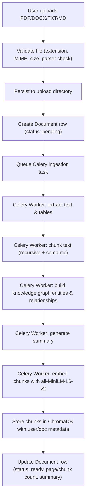

**At query time (chat):**

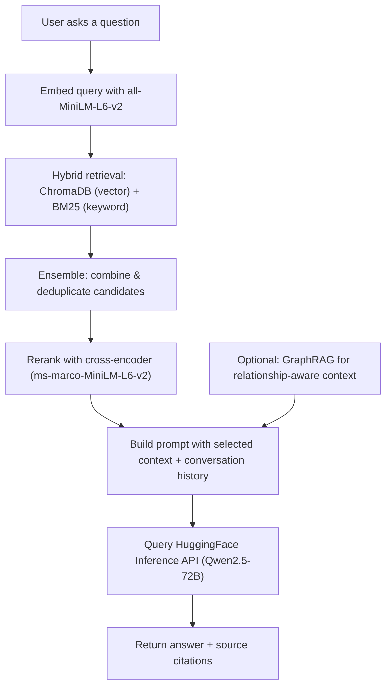

The retriever uses a **two-stage strategy**:
1. **Stage 1 — Hybrid Ensemble**: Combines ChromaDB vector similarity search
   (dense) with BM25 keyword retrieval (sparse). Configurable `TOP_K_RETRIEVAL`
   (default: 10 candidates).
2. **Stage 2 — Cross-Encoder Reranking**: Re-scores candidates with
   `cross-encoder/ms-marco-MiniLM-L-6-v2` and keeps the top
   `TOP_K_RERANK` (default: 5). If the reranker model fails to load,
   the pipeline falls back to embedding-only retrieval.

Embeddings use `sentence-transformers/all-MiniLM-L6-v2` (384 dimensions),
loaded once at startup and shared across all users.

### Authentication Flow

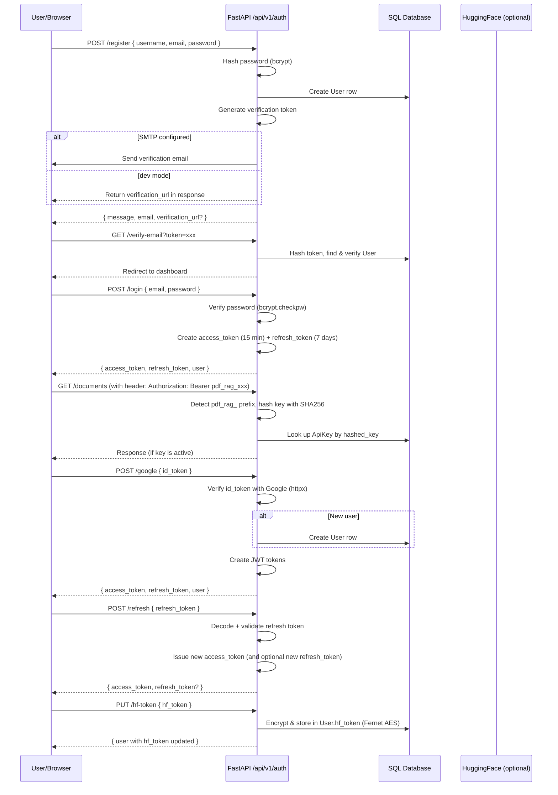

**Key authentication mechanisms:**

| Method | Mechanism | Token Format | Expiry |
|--------|-----------|-------------|--------|
| Password | bcrypt hashing + JWT | Bearer `access_token` | 15 min |
| Refresh | JWT with `type: "refresh"` | Rotated on use | 7 days |
| API Key | SHA256 hash lookup | `pdf_rag_...` prefix | Manual revoke |
| Google OAuth | ID token verification via Google API | Auto-creates JWT | Per-session |

The `get_current_user` FastAPI dependency (in `app/auth.py`) handles all auth
methods transparently:
1. Checks `Authorization: Bearer` header (JWT or API key)
2. Falls back to secure cookie (`access_token` cookie)
3. API keys are detected by the `pdf_rag_` prefix and validated via SHA256 hash
4. Returns `403 Forbidden` for admin-only routes via `get_admin_user`

**Email verification flow:**
- On registration, a 32-byte random token is generated, SHA256-hashed, and
  stored in `verification_token_hash`.
- If SMTP is configured, a verification email is sent with the link.
- In development without SMTP, the response includes a `verification_url`.
- Tokens expire after `EMAIL_VERIFICATION_TOKEN_EXPIRE_HOURS` (default: 24).

### Data Models & Relationships

```
┌──────────────────────────┐
│          User            │
├──────────────────────────┤
│ id (UUID, PK)            │
│ username, email          │
│ hashed_password          │
│ role (user | admin)      │
│ is_verified              │
│ hf_token (encrypted)     │
│ display_name, avatar_url │
│ created_at, last_login   │
├──────────────────────────┤
│ 1 ──< Document           │
│ 1 ──< ChatSession        │
│ 1 ──< ChatMessage        │
│ 1 ──< ApiKey             │
│ 1 ──< DriveConnection    │
└──────────────────────────┘

┌──────────────────────────┐
│        Document          │
├──────────────────────────┤
│ id (UUID, PK)            │
│ user_id (FK → User)      │
│ filename, original_name  │
│ file_size, page_count    │
│ chunk_count              │
│ status (pending|processing|ready|failed) │
│ summary                  │
│ uploaded_at, last_accessed_at │
│ is_deleted, deleted_at   │
│ drive_file_id, drive_folder_id │
├──────────────────────────┤
│ * ──1 User               │
│ 1 ──< ChatMessage        │
└──────────────────────────┘

┌──────────────────────────┐
│      ChatSession         │
├──────────────────────────┤
│ id (UUID, PK)            │
│ user_id (FK → User)      │
│ title                    │
│ created_at               │
├──────────────────────────┤
│ * ──1 User               │
│ 1 ──< ChatMessage        │
└──────────────────────────┘

┌──────────────────────────┐
│      ChatMessage         │
├──────────────────────────┤
│ id (UUID, PK)            │
│ user_id (FK → User)      │
│ document_id (FK → Doc, nullable) │
│ session_id (FK → Session, nullable) │
│ role (user | assistant)  │
│ content                  │
│ sources_json (JSON text) │
│ feedback (up | down | null) │
│ created_at               │
├──────────────────────────┤
│ * ──1 User               │
│ * ──1 Document           │
│ * ──1 ChatSession        │
│ 1 ──0..1 SharedMessage   │
└──────────────────────────┘

┌──────────────────────────┐
│         ApiKey           │
├──────────────────────────┤
│ id (UUID, PK)            │
│ user_id (FK → User)      │
│ key_prefix               │
│ hashed_key (SHA256)      │
│ is_active                │
│ created_at, last_used_at │
├──────────────────────────┤
│ * ──1 User               │
└──────────────────────────┘

┌──────────────────────────┐
│    SharedMessage         │
├──────────────────────────┤
│ id (UUID, PK)            │
│ message_id (FK → ChatMessage, unique) │
│ created_at               │
├──────────────────────────┤
│ * ──1 ChatMessage        │
└──────────────────────────┘

┌──────────────────────────┐
│   DriveConnection        │
├──────────────────────────┤
│ id (UUID, PK)            │
│ user_id (FK → User)      │
│ folder_id                │
│ credentials_json         │
│ enabled                  │
│ last_synced_at           │
└──────────────────────────┘

┌──────────────────────────┐
│  WorkspaceInvitation     │
├──────────────────────────┤
│ id (UUID, PK)            │
│ email                    │
│ token_hash (SHA256)      │
│ inviter_id (FK → User)   │
│ workspace_name           │
│ expires_at, accepted_at  │
└──────────────────────────┘
```

**Key design decisions:**
- UUIDs are stored as strings for SQLite compatibility, native UUID type on
  PostgreSQL via the `GUID` type decorator.
- `hf_token` is encrypted at rest using Fernet (AES via `cryptography`),
  derived from `SECRET_KEY`.
- Documents use **soft-delete** (`is_deleted` flag) to preserve references.
- Chunk vectors in ChromaDB are keyed by `document_id` and `user_id` for
  multi-tenant isolation.
- `sources_json` stores source citations as a JSON string (not a relational
  table) for simplicity — sources are always read/written as a unit.

### Background Tasks

The application uses two background processing mechanisms:

**1. Celery Workers (async document ingestion)**

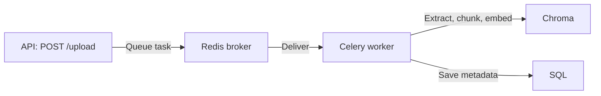

- **Broker/Backend:** Redis (`CELERY_BROKER_URL`, `CELERY_RESULT_BACKEND`)
- **Task definition:** `app/tasks.py` — `process_document()` function
- **Worker command:** `celery -A app.celery_app worker --loglevel=info`
- Processing status is tracked in `Document.status` (pending → processing →
  ready/failed)

**2. In-process background loops (lightweight maintenance)**

```python
# In main.py lifespan — runs asyncio.create_task
async def document_cleanup_job():
    """Periodically purge documents not accessed in 30 days."""
    while True:
        # Query expired documents, delete files + vectors + DB rows
        await asyncio.sleep(86400)  # Every 24 hours
```

**3. APScheduler (periodic sync jobs)**

Configured in `app/scheduler.py` via `start_scheduler()`:
- Google Drive sync (`DRIVE_SYNC_ENABLED` + `DRIVE_SYNC_INTERVAL_MINUTES`)
- Metrics export (Prometheus endpoint at `/metrics`)

---

## Frontend Architecture

### Pages & Routing (Next.js App Router)

```
frontend/src/app/
├── layout.tsx              # Root layout: ThemeProvider, AuthProvider, i18n, Tooltip
├── page.tsx                # Landing page (hero, features, GitHub stats, footer)
├── globals.css             # Tailwind v4 global styles + theme definitions
├── login/
│   └── page.tsx            # Login page (email/password + Google OAuth)
├── register/
│   └── page.tsx            # Registration page
├── verify-email/
│   └── page.tsx            # Email verification handler
├── dashboard/
│   └── page.tsx            # Main dashboard (chat interface + document sidebar)
├── drive/
│   └── page.tsx            # Google Drive integration page
├── admin/
│   └── page.tsx            # Admin panel (users, system stats)
├── share/
│   └── [id]/
│       └── page.tsx        # Public shared message view
├── privacy/
│   └── page.tsx            # Privacy policy (static, prose layout)
└── terms/
    └── page.tsx            # Terms of service (static, prose layout)
```

**Layout hierarchy:**

```
<html> (RootLayout)
  └── <ThemeProvider> (next-themes — light/dark/ocean/forest/sunset)
      └── <AuthProvider> (JWT token sync, auth events)
          └── <I18nProvider> (react-i18next)
              └── <TooltipProvider> (@base-ui/react tooltip context)
                  └── <Toaster> (sonner toast notifications)
```

### State Management (Zustand)

Two Zustand stores manage client-side state:

**1. `auth-store.ts` — Authentication state**
```typescript
interface AuthStore {
  user: AuthUser | null;       // Current user profile
  token: string | null;        // JWT access token
  loading: boolean;            // Initial auth check in progress
  initialized: boolean;        // Auth initialization complete

  // Actions
  login(email, password)       // POST /api/v1/auth/login
  loginWithGoogle(idToken)     // POST /api/v1/auth/google
  register(username, email, password)  // POST /api/v1/auth/register
  logout()                     // POST /api/v1/auth/logout + clear tokens
  initializeAuth()             // GET /api/v1/auth/me (restore session)
  setHfToken(hfToken)          // PUT /api/v1/auth/hf-token
  syncTokensRefreshed(detail)  // Handle auth:tokens-refreshed event
  syncLoggedOut()              // Handle auth:logged-out event
}
```

**2. `chat-store.ts` — Chat state**
```typescript
interface ChatStore {
  messages: ChatMsg[];         // Current session messages
  input: string;               // Chat input text
  streaming: boolean;          // SSE stream in progress
  isTyping: boolean;           // Typing indicator (API generating)
  historyLoading: boolean;     // Loading session history
  sessions: ChatSession[];     // All user sessions
  activeSessionId: string | null;  // Currently active session

  // Actions
  fetchSessions()              // GET /api/v1/chat/sessions
  createSession(title)         // POST /api/v1/chat/sessions
  renameSession(id, title)     // PUT /api/v1/chat/sessions/{id}
  deleteSession(id)            // DELETE /api/v1/chat/sessions/{id}
  fetchSessionHistory(id)      // GET /api/v1/chat/history/session/{id}
  resetChat()                  // Reset all state
}
```

**Store pattern:** Each store uses Zustand's `create()` with the setter/getter
pattern. A generic `resolveValue` helper supports both direct values and
updater functions for `setMessages`, `setInput`, etc.

### API Client Layer

`src/lib/api.ts` — A thin wrapper around `fetch()` that provides:

```typescript
class ApiClient {
  // Typed HTTP methods with auto-refresh
  async get<T>(path, options?)      // GET request
  async post<T>(path, body?, options?)  // POST request
  async put<T>(path, body?, options?)   // PUT request
  async patch<T>(path, body?, options?) // PATCH request
  async delete<T>(path, options?)       // DELETE request
  async postForm<T>(path, formData, options?) // Multipart form upload

  // SSE streaming
  async *streamPost(path, body)     // POST → SSE stream (AsyncGenerator)

  // Utilities
  getPdfUrl(documentId)             // Construct PDF download URL with token
}
```

**Key features:**
- Automatic JWT token injection from `localStorage`
- Transparent 401 → token refresh → retry (prevents race conditions with a
  mutex guard on `refreshPromise`)
- Structured error messages from backend `{ detail }` payloads
- Connection error detection (TypeError → user-friendly message)
- Dispatches `auth:tokens-refreshed` and `auth:logged-out` custom events for
  store synchronization

### Component Tree

```
frontend/src/components/
├── auth/
│   ├── AuthProvider.tsx       # Auth context: listens to token events
│   ├── HfTokenModal.tsx       # HuggingFace token configuration modal
│   └── ApiKeyManager.tsx      # API key management dialog
│
├── chat/
│   ├── ChatPanel.tsx          # Main chat container
│   ├── MessageBubble.tsx      # Single message (markdown, copy, share, speech, feedback)
│   ├── SourceCard.tsx         # Source citations card (collapsible, confidence badges)
│   └── WelcomeScreen.tsx      # Landing placeholder when no messages
│
├── document/
│   ├── DocumentSidebar.tsx    # Document list sidebar with upload
│   ├── FileUploader.tsx       # Drag-and-drop file upload zone
│   └── DocumentTable.tsx      # Document table with status icons
│
├── layout/
│   ├── ThemeProvider.tsx      # next-themes wrapper with custom themes
│   ├── Sidebar.tsx            # Navigation sidebar
│   ├── Navbar.tsx             # Top navigation bar
│   └── Footer.tsx             # Landing page footer
│
├── providers/
│   └── I18nProvider.tsx       # react-i18next initialization
│
├── ui/                        # Base UI primitives (shadcn-style wrappers)
│   ├── button.tsx             # Button (@base-ui/react/button + CVA)
│   ├── badge.tsx              # Badge component
│   ├── tooltip.tsx            # Tooltip (@base-ui/react/tooltip)
│   ├── dialog.tsx             # Dialog (@base-ui/react/dialog)
│   ├── input.tsx              # Input with base-ui
│   ├── dropdown-menu.tsx      # Dropdown menu
│   ├── confirm-dialog.tsx     # Confirmation dialog (danger/warning/default variants)
│   └── ...                    # Other primitives
│
├── DriveFolderSelector.tsx    # Google Drive folder picker
└── EmptyState.tsx             # Generic empty state display
```

**UI component design:**
- All UI primitives are wrappers around `@base-ui/react` (v1.4.1)
- Variants managed via `class-variance-authority` (CVA)
- Class merging via `tailwind-merge` + `clsx`
- Icons from `lucide-react`
- Styling with Tailwind CSS v4 + `tw-animate-css` for animations

### Data Flow: Action → Store → API → Response → UI

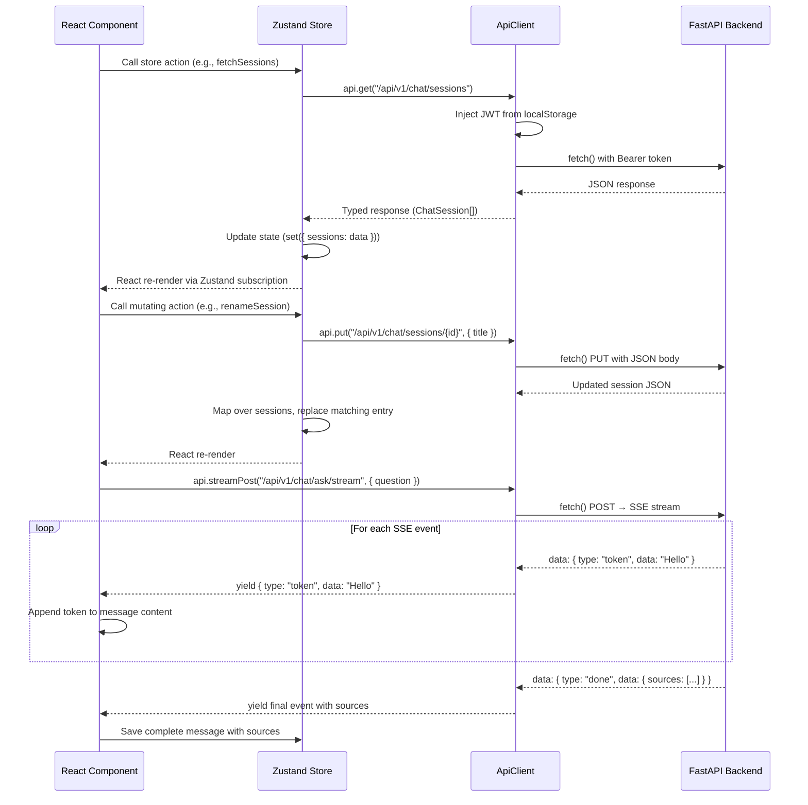

---

## Infrastructure

### Docker Multi-Stage Build

The `Dockerfile` uses three stages to minimise the final image size:

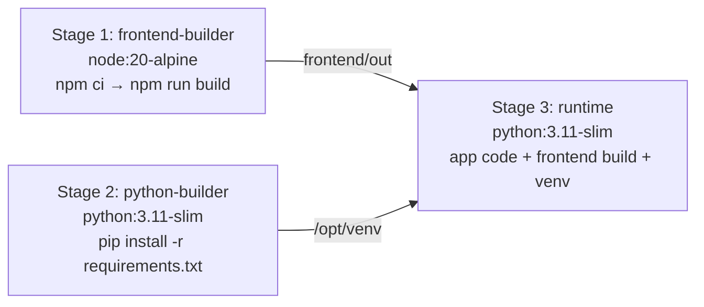

1. **frontend-builder** — Builds Next.js static export (`frontend/out`)
2. **python-builder** — Installs Python deps in a virtualenv, including spaCy
   model `en_core_web_sm` and system packages (`libmagic1`, `build-essential`)
3. **runtime** — Copies only the venv and app code. Runs as user 1000
   (HuggingFace Spaces requirement). Exposes port 7860.

```bash
CMD ["uvicorn", "app.main:app", "--host", "0.0.0.0", "--port", "7860"]
```

The `docker-compose.yml` provides a full local stack with Redis and Celery worker.

### CI/CD Pipelines

The project uses GitHub Actions with these workflows (all in `.github/workflows/`):

| Workflow | File | Trigger | What it does |
|----------|------|---------|-------------|
| **CI — Dev Branch** | `ci.yml` | Push/PR to `dev` | Backend lint (flake8), import check, pytest (40% coverage), CodeQL analysis, frontend type-check (tsc), ESLint, Vitest, Next.js build, PR size gate |
| **E2E Tests** | `e2e.yml` | PR to `dev` | Playwright E2E tests against full stack |
| **Sync Issue Labels** | `sync-issue-labels.yml` | `opened` → PR | Copies labels from referenced issue to PR |
| **GSSOC Welcome** | `gssoc-welcome.yml` | Issue/PR open | Welcome message for GSSoC contributors |
| **Deploy** | `deploy.yml` | Push to `main` | HuggingFace Spaces deployment |
| **DevSecOps** | `devsecops.yml` | Push/PR to `dev` | Additional security scanning |

**CI checks that must pass before merge:**
1. 🐍 Backend lint & import check (flake8 errors only)
2. 🔎 CodeQL security analysis (fails on severity ≥ 9.0)
3. ⚛️ Frontend type check (`tsc --noEmit`)
4. ⚛️ ESLint
5. 🧪 Frontend unit tests (Vitest)
6. ⚛️ Next.js production build
7. 📏 PR size gate (warns > 1000 lines)

### Environment Configuration

Configuration uses **pydantic-settings** (v2) loaded from environment variables
with an optional `.env` file.

**Key configuration groups (`backend/app/config.py`):**

```python
class Settings(BaseSettings):
    # App
    APP_NAME: str = "Document AI Analyst"
    ENVIRONMENT: str = "development"
    SECRET_KEY: str              # Required — change in production

    # Database
    DATABASE_URL: str = "sqlite:///./data/app.db"

    # Auth
    JWT_ALGORITHM: str = "HS256"
    JWT_ACCESS_EXPIRY_MINUTES: int = 15
    JWT_REFRESH_EXPIRY_DAYS: int = 7
    GOOGLE_CLIENT_ID: str = ""   # For Google OAuth

    # RAG Pipeline
    CHUNK_SIZE: int = 1000
    CHUNK_OVERLAP: int = 200
    TOP_K_RETRIEVAL: int = 10
    TOP_K_RERANK: int = 5

    # Embeddings
    EMBEDDING_MODEL: str = "sentence-transformers/all-MiniLM-L6-v2"

    # LLM (HuggingFace)
    HF_TOKEN: str                # Required for Inference API
    LLM_MODEL: str = "Qwen/Qwen2.5-72B-Instruct"

    # Celery / Redis
    CELERY_BROKER_URL: str = "redis://localhost:6379/0"

    # File Upload
    UPLOAD_DIR: str = "./data/uploads"
    MAX_UPLOAD_SIZE_MB: int = 50

    # ChromaDB
    CHROMA_PERSIST_DIR: str = "./data/chroma_db"
```

**Environment files:**
- `.env.example` — Template with all variables and placeholder values
- `.env` — Local overrides (gitignored)
- **Never commit `.env` files with real secrets**

**CORS configuration:**
- In production: restricted to `ALLOWED_ORIGINS` (comma-separated list)
- In development: open (`["*"]`) for local testing

---

## Data Flow Diagrams

### Upload → Process → Query

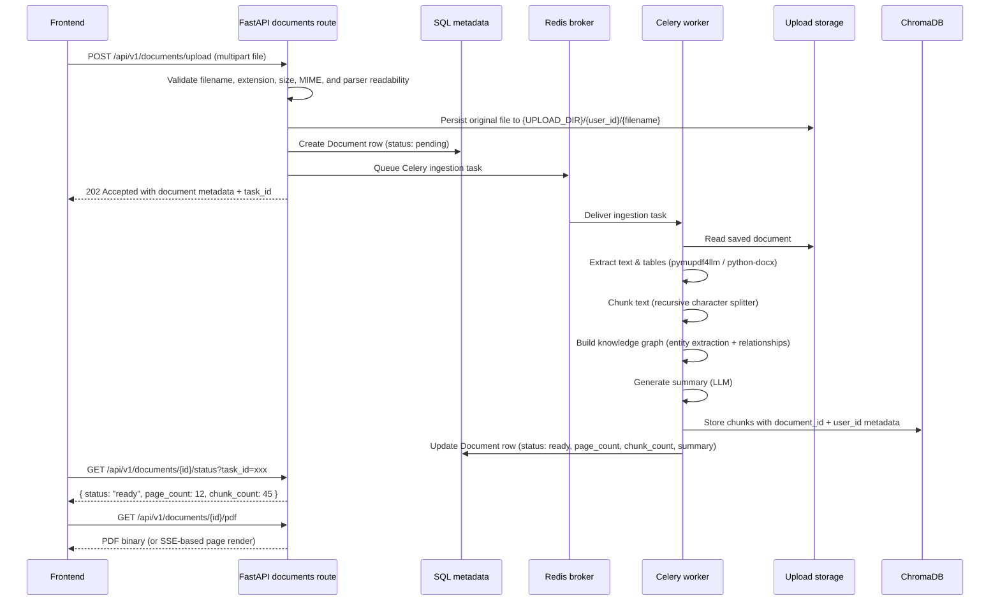

### Login → Token Refresh → OAuth

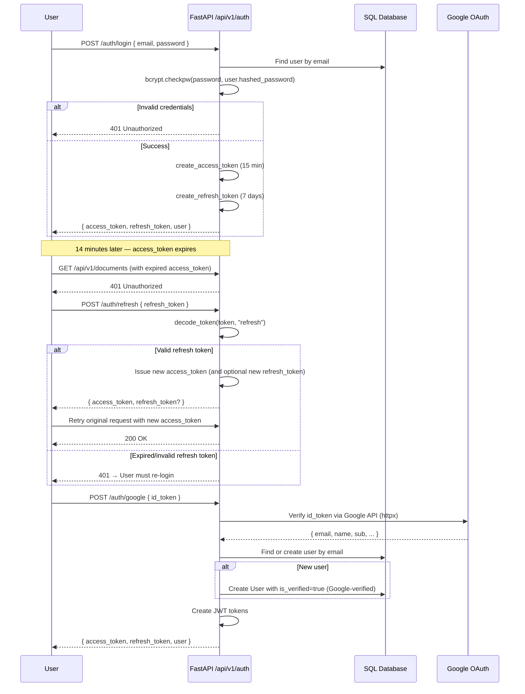

### Question → RAG → Streamed Answer

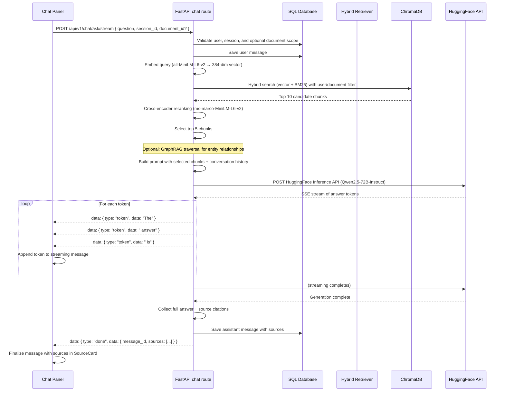

---

## Data Ownership And Boundaries

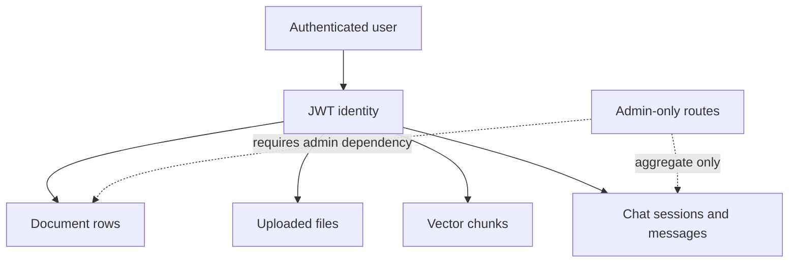

User-facing routes must filter by `user.id` before reading or mutating
documents, chat sessions, messages, uploaded files, or vector chunks. Admin
routes use `get_current_admin` and should avoid returning secrets, tokens, file
contents, or raw vector payloads.

**Vector data isolation:** ChromaDB collections use a shared collection with
per-document `user_id` metadata. Every vector query filters by `user_id` to
prevent cross-user data leakage.

---

## Swagger And OpenAPI Notes

FastAPI builds the OpenAPI schema from route decorators, response models,
function names, parameter annotations, and docstrings. When adding or changing
an endpoint:

- Add a concise `summary` when the function name is not enough for Swagger.
- Use a docstring to describe ownership rules, side effects, and response shape.
- Keep `response_model` accurate so generated examples match real responses.
- Prefer typed query/body models over loosely shaped dictionaries.
- Mention asynchronous side effects, such as background ingestion or SSE
  streaming, in the route description.

---

## Local Contributor Checklist

Before opening a backend documentation or route metadata PR:

1. Run Python compilation for touched route files.
2. Run the fatal-error flake8 selection used by CI.
3. Check Markdown fences and Mermaid blocks render as plain GitHub Markdown.
4. Confirm the README links to any new contributor-facing docs.
5. Run `npm test` in `frontend/` if touching frontend code.
6. Verify all CI checks pass before requesting review.
