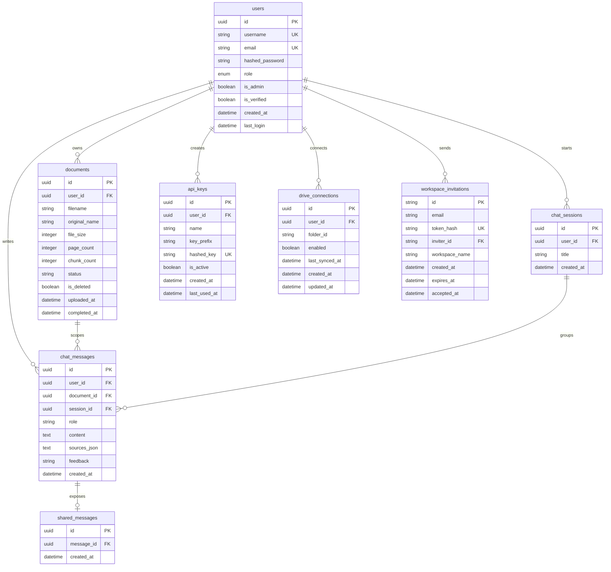

# Database Schema

This guide documents the backend relational schema used by
PDF-Assistant-RAG. The current implementation is defined with SQLAlchemy ORM
models in `backend/app/models.py` and is initialized through
`backend/app/database.py`.

## Runtime Database

The application reads `DATABASE_URL` from settings. SQLite is the default local
database, while non-SQLite URLs use SQLAlchemy's pooled engine configuration.
On startup, `init_db()` imports the models, creates any missing tables, and runs
small non-destructive migrations for columns added after existing databases were
created.

All primary application tables use user-owned data boundaries. Most user data is
deleted through ORM cascades when a user row is removed.

## Entity Relationship Diagram

## Tables

### `users`

Stores registered users and authentication metadata.

Important columns:

- `id`: GUID primary key.
- `username` and `email`: unique indexed identity fields.
- `hashed_password`: password hash used for email/password login.
- `google_refresh_token` and `hf_token`: encrypted token fields.
- `role`: `user` or `admin` enum for role-based access control.
- `is_admin`: legacy admin flag kept alongside `role`.
- `is_verified`, `verification_token_hash`,
  `verification_token_created_at`: email verification state.
- `created_at` and `last_login`: account audit timestamps.

Relationships:

- One user owns many `documents`.
- One user writes many `chat_messages`.
- One user starts many `chat_sessions`.
- One user owns many `api_keys`.
- One user owns many `drive_connections`.

### `documents`

Stores uploaded document metadata and ingestion status. File bytes live outside
the relational database in upload storage; vector chunks live in ChromaDB.

Important columns:

- `id`: GUID primary key.
- `user_id`: required foreign key to `users.id`.
- `filename` and `original_name`: stored filename and original upload name.
- `file_size`, `page_count`, `chunk_count`: processing metrics.
- `status`, `processing_progress`, `processing_stage`, `retry_count`:
  ingestion state.
- `summary`, `chunk_size`, `chunk_overlap`, `extracted_urls`: document analysis
  metadata.
- `drive_file_id`, `drive_folder_id`, `drive_synced_at`: Google Drive sync
  metadata.
- `is_deleted` and `deleted_at`: soft-delete state.
- `uploaded_at`, `last_accessed_at`, `processing_started_at`, `completed_at`:
  lifecycle timestamps.

Relationships:

- Many documents belong to one `users` row.
- One document can scope many `chat_messages`.

### `chat_sessions`

Groups chat messages into logical threads for a user.

Important columns:

- `id`: GUID primary key.
- `user_id`: required foreign key to `users.id`.
- `title`: user-facing session title.
- `created_at`: session creation timestamp.

Relationships:

- Many sessions belong to one user.
- One session groups many chat messages.

### `chat_messages`

Stores persistent chat history for user and assistant turns.

Important columns:

- `id`: GUID primary key.
- `user_id`: required foreign key to `users.id`.
- `document_id`: optional foreign key to `documents.id`; null allows
  document-independent chat.
- `session_id`: optional foreign key to `chat_sessions.id`.
- `role`: message author role, commonly `user` or `assistant`.
- `content`: message body.
- `sources_json`: serialized source citation metadata.
- `feedback`: optional user feedback such as `up` or `down`.
- `created_at`: message timestamp.

Relationships:

- Many messages belong to one user.
- Many messages can be scoped to one document.
- Many messages can be grouped under one chat session.
- One message can have one `shared_messages` row.

### `api_keys`

Stores hashed API keys for programmatic access.

Important columns:

- `id`: GUID primary key.
- `user_id`: required foreign key to `users.id`.
- `name`: user-facing key name.
- `key_prefix`: short visible prefix for identification.
- `hashed_key`: unique indexed key hash.
- `is_active`: revocation flag.
- `created_at` and `last_used_at`: audit timestamps.

Relationships:

- Many API keys belong to one user.

### `drive_connections`

Stores Google Drive sync connection metadata.

Important columns:

- `id`: GUID primary key.
- `user_id`: required foreign key to `users.id`.
- `folder_id`: connected Drive folder.
- `credentials_json` and `service_account_file`: credential references.
- `enabled`: sync toggle.
- `last_synced_at`, `created_at`, `updated_at`: sync lifecycle timestamps.

Relationships:

- Many Drive connections belong to one user.

### `workspace_invitations`

Stores pending workspace invitations.

Important columns:

- `id`: string primary key generated with `uuid4`.
- `email`: invited email address.
- `token_hash`: unique indexed invitation token hash.
- `inviter_id`: required foreign key to `users.id`.
- `workspace_name`: target workspace display name.
- `created_at`, `expires_at`, `accepted_at`: invitation lifecycle timestamps.

Relationships:

- Many invitations can be sent by one user.

### `shared_messages`

Links chat messages to public share records.

Important columns:

- `id`: GUID primary key.
- `message_id`: required unique foreign key to `chat_messages.id`.
- `created_at`: share creation timestamp.

Relationships:

- One shared message belongs to exactly one chat message.

## Relationship Summary

| Parent | Child | Cardinality | Delete behavior |
| --- | --- | --- | --- |
| `users` | `documents` | one-to-many | ORM cascade delete-orphan |
| `users` | `chat_messages` | one-to-many | ORM cascade delete-orphan |
| `users` | `chat_sessions` | one-to-many | ORM cascade delete-orphan |
| `users` | `api_keys` | one-to-many | ORM cascade delete-orphan |
| `users` | `drive_connections` | one-to-many | ORM cascade delete-orphan |
| `users` | `workspace_invitations` | one-to-many | no explicit cascade |
| `documents` | `chat_messages` | one-to-many | ORM cascade delete-orphan |
| `chat_sessions` | `chat_messages` | one-to-many | ORM cascade delete-orphan |
| `chat_messages` | `shared_messages` | one-to-one | ORM cascade delete-orphan |

## Data Ownership Rules

- User-facing document and chat queries should filter by `user_id`.
- Document-scoped chat messages should validate that the document belongs to
  the authenticated user before reading or writing history.
- Shared messages expose one selected chat message and should not bypass other
  ownership checks when adding new sharing features.
- Admin routes should aggregate operational data without returning encrypted
  tokens, password hashes, raw file contents, or vector payloads.

## Migration Notes

`Base.metadata.create_all()` creates missing tables, but it does not add new
columns to existing tables. The `_migrate_schema()` helper in
`backend/app/database.py` applies small SQLite-compatible column additions for
existing databases, including newer user verification fields, API key metadata,
document soft-delete and Drive metadata, and chat message feedback.

For larger schema changes, prefer an explicit migration plan instead of relying
on startup-time column checks.
